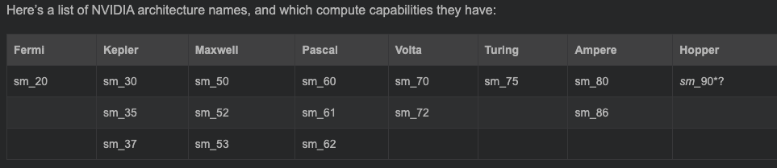
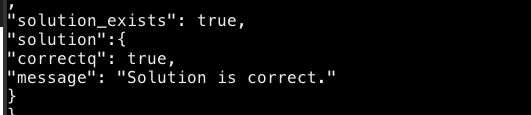

## Code Project For Course ECE408
This is code project for ECE408(Applied Parallel Programming). And you can use this project as a good start for your own lab implementation. Here's how you finish your own project. [You can get all slices here](http://ece408.hwu-server2.crhc.illinois.edu/_layouts/15/start.aspx#/SitePages/Home.aspx).

### 1. Finish your own code based on template code
`templates/mpx_template.cu` are template codes and you need to full fill these code files. For me, I add these implementations in `mpx_implement.cu`.

### 2. Add your code to CmakeLists.txt
Once you finish your new implementation code, you need to add it to `CmakeLists.txt` so it can be compiled.
    
    // mpx_implement.cu is your implementation code file name.
    CUDA_ADD_EXECUTABLE(MPX_Implement mpx_implement.cu ${wbhdr} ${wbsrc})

**NOTICE:** In `CmakeLists.txt`, this line set GPU arch and code generation configuration. Change it if your GPU arch is not `sm_86`.

### 2. Compile & Run
    mkdir build
    cd build
    cmake ..
    make 

Executable files will be generated in under `build/`, and any time when you update your implementation you just need to rerun `make` under `build/`. But if you update your `CmakeLists.txt`, you should run `cmake ..` first and then run `make` to compile all codes.

## Test Dataset
datasets for code test are under `test_data/`, you can use them to test your implementation with
     
     ./program -e <expected_output_file> -i <input_file_1>,<input_file_2> -o <output_file> -t <type>

The `<expected_output_file>` and `<input_file_n>` are the input and output files provided in the dataset. The `<output_file>` is the location you’d like to place the output from your program. The`<type>` is the output file type: `vector`, `matrix`, or `image`. If an MP does not expect an input or output, then pass none as the parameter.

For example, if you want test mp1_implementatiton, you can run
    
    #suppose you are in ./build directory

    ./MP1_Implement -e ../test_data/mp01/0/output.raw -i ../test_data/mp01/0/input0.raw,../test_data/mp01/0/input1.raw -o ../test_data/mp01/0/res.raw -t vector 
And if you see logs like this, then congratulations, you have passed the test!

## Generate your own dataset
You can generate your own dataset if you want more test. For example, you can use `MP2_Dataset` to generate dataset.

    MP2_Dataset -d /data/directory/ -ra 100 -ca 128 -rb 128 -cb 256

