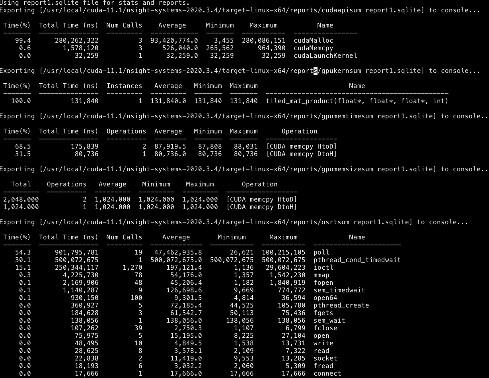

Code For Course ECE408
## hello_world.cu
    nvcc hello_world.cu -o hello_world
    ./hello_world
*Notes:*
`cudaDeviceSynchronize` should be used to synchronize host with device, or we will not see any output from cuda kernel

## mp01.cu
    nvcc mp01.cu -o mp01
    ./mp01
*Notes:*
`mp01.cu` is for vector_add

## mp02_mat_product_tiled.cu
    nvcc mp02_mat_product_tiled -o tiled_mult
    ./tiled_mult

