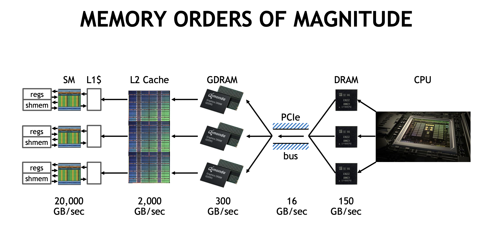
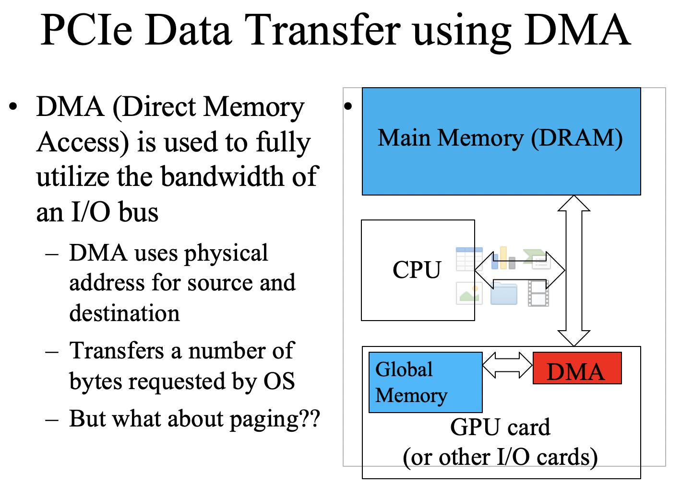
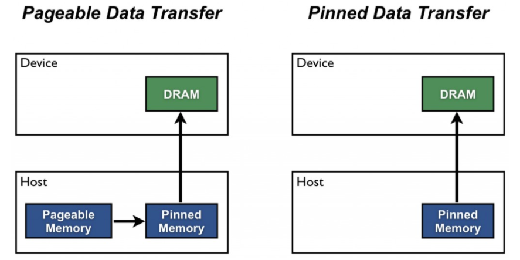
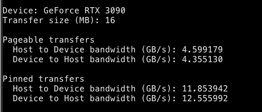

# Data Transfer

## Data transfer difference between pageble memory and page-locked memory/pinned memory

Memory copy from cpu to gpu use DMA to fully utilize the bandwidth of the I/O bus, DMA use physical address and to avoid pages under transferring being paged out, CPU first copy the data needs to be transferred to a temperary page-locked memory and then use DMA to transfer it to GPU global memory. So if we directly allocate memory in page-locked memory, we can save one memory copying from cpu to cpu. The cudaMemcpy function should be about 2X faster with pinned memory.

But you should not over-allocate pinned memory. Doing so can reduce overall system performance because it reduces the amount of physical memory available to the operating system and other programs and may cause severe performance degradation because of frequent memory swapping.

You can use the [memory_transfer_test](../tools/memory_transfer.cu) code to test the bandwidth difference between pageable memory and page-locked memory. Here is benchmark result on my machine:

