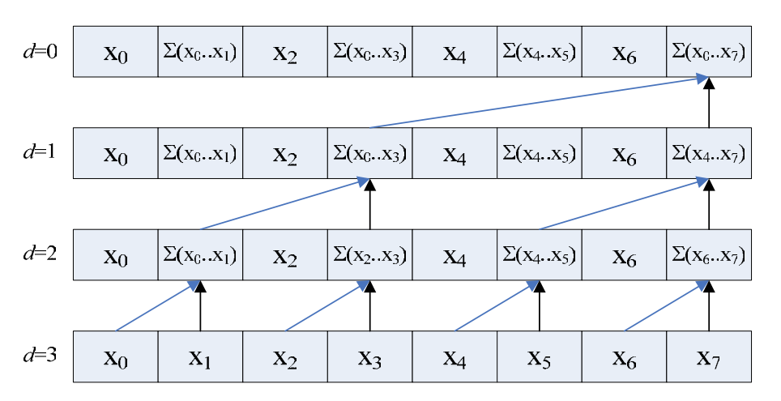
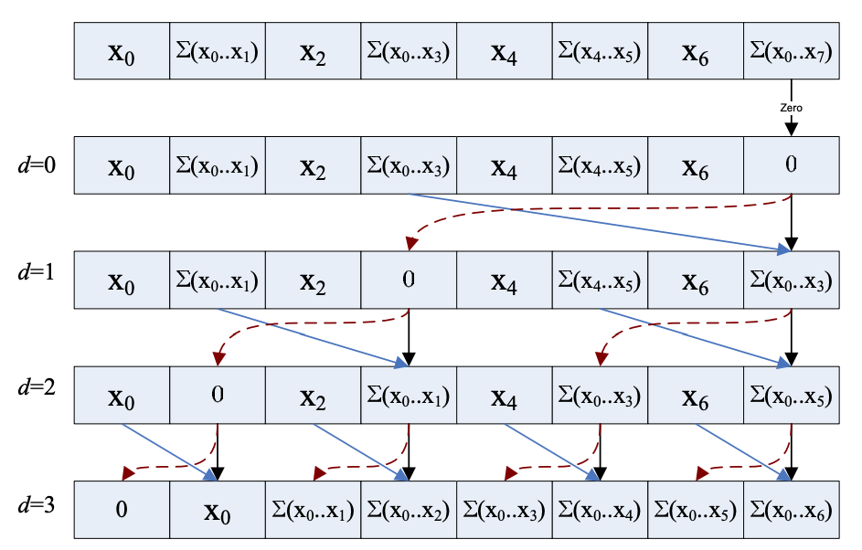
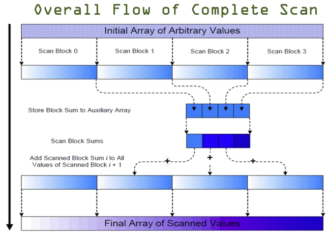

# mp05课程notes

## Efficient Parallel Scan
The idea is to build a balanced binary tree on the input data and sweep it to and from the root to compute the prefix sum. A binary tree with n leaves has log n levels, and each level d∈[0,n) has 2d nodes. If we perform one add per node, then we will perform O(n) adds on a single traversal of the tree.

The algorithm consists of two phases: the reduce phase (also known as the up-sweep phase) and the down-sweep phase. 

This picture illustrates `up-sweep phase`

The following illustrate `down-sweep phase`

## Process Arbitrary Sized Array
We use kernel decomposition to process arbitrary sized array.

## Avoiding Bank Conflicts

`To Be Finished`

