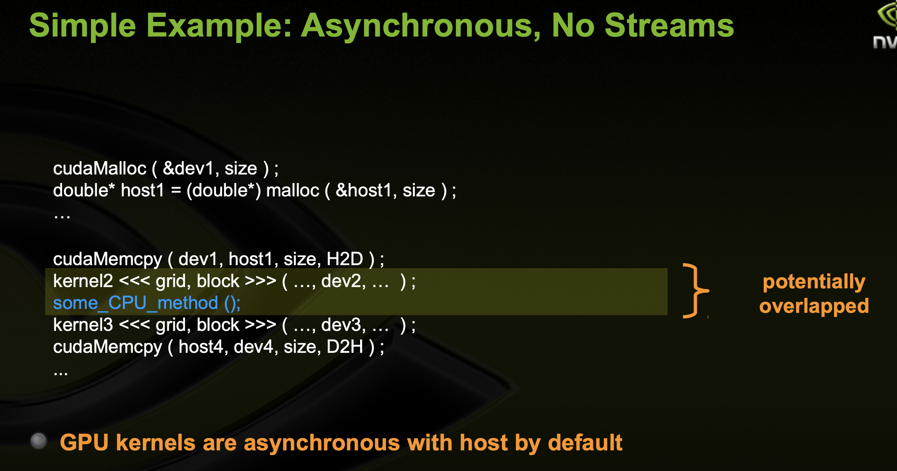
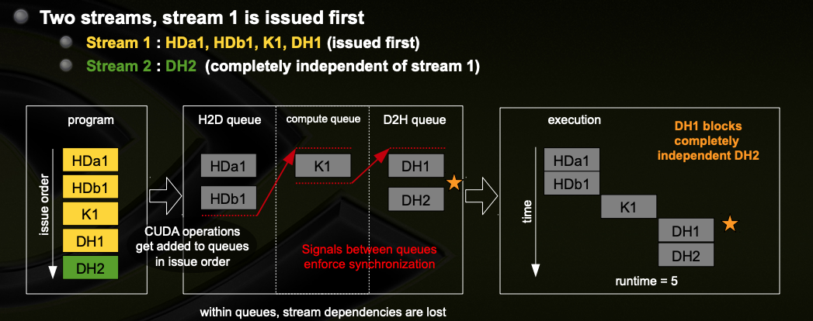
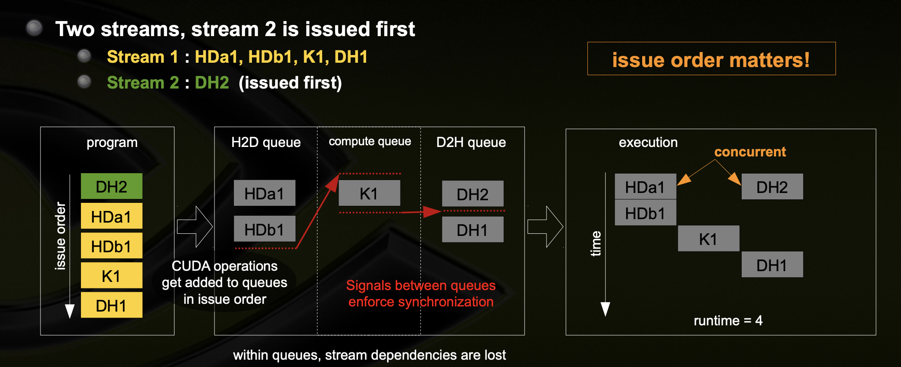
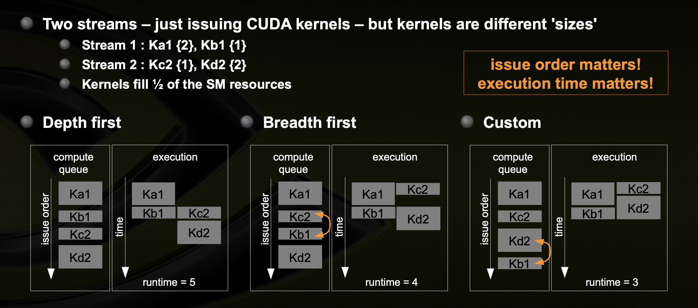

# Stream and Concurrency

## Operations can be performed simultaneously by CUDA(beyond multi-threaded parallelism)

- CUDA Kernel <<<>>>
- cudaMemcpyAsync(HostToDevice)
- cudaMemcpyAsync(DeviceToHost)
- Operations on the CPU

Fermi architechture can simultaneously support
- Up to 16 CUDA kernels
- 2 cudaMemcpyAsyncs(must be in different directions)
- Computations on the CPU

## Streams

`Stream`: A sequence of operations that execute in issue-order on the GPU

Programming model used to effect concurrency:

- CUDA operations in different streams may run concurrently
- CUDA operations from different streams may be interleaved

## Requirements for Concurrency

- CUDA operations must be in different, non-0, streams
- cudaMemcpyAsync with host from `pinned` memory
    - Page-locked memory
    - Allocated using `cudaMallocHost()` or `cudaHostAlloc`

- Sufficient resources must be avaliable
    - cudaMemcpyAsync in different directions
    - Device resources(SHMEM, registers, blocks, etc..)

## Explicit Synchronization && Implicit Synchronization

### Explicit Synchronization

- Synchronize everything

    - `cudaDeviceSynchronize()`: Blocks host until all issued CUDA calls are complete
- Synchronize w.r.t a specific stream

    - `cudaStreamSynchronize(streamid)`: Block host until all CUDA calls in streamid are complete

- Synchronize using Events

    - Create specific `Events`, `within streams`, to use for synchronization.
    - cudaEventRecord(event, streamid)
    - cudaStreamWaitEvent(stream, event)
    - cudaEventQuery(event)

## Stream Scheduling

### Fermi hardware has 3 queues

- 1 Compute Engine queue
- 2 Copy Engine queues - one for H2D and one for D2H

### CUDA operations are dispatched to HW in the sequence they are issued

- Placed in the relevant queue
- Stream dependencies between engine queues are maintained, but lost within an engine queue.

### A CUDA operations is dispatched from engine queue if:

- Preceding calls in the same stream have completed
- Preceding calls in the same queue have been dispatched, and
- Resources are avaliable

### CUDA kernels may be executed concurrently if they are in different streams
- ThreadBlocks for a given kernel are schduled if all threadblocks for preceding kernels have been schduled and there still are SM resources avaliable

**Note a blocked operation blocks all other operations in the queue, even in other streams**

## Examples

### Kernel Issue Order Matters

- Breadth First Kernel issue 

### Execution Time Matters

## Concurrency Guidelines

### Code to programming model - Streams

- Future devices will continually improve HW representations of streams model

### Pay attention to issue order

- Can make a difference

### Pay attention to resources and operations which can break concurrency

### Use tools(Visual Profiler) to visualize concurrency

## TODO

学习Profile的工具的使用

